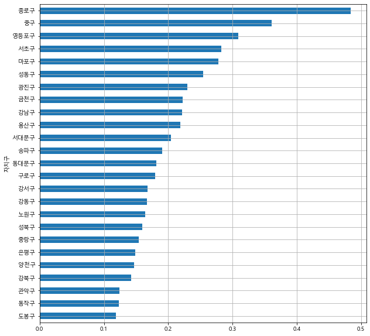

# Seoul_Public_Bike
#### 서울시 따릉이 현황 - python 활용

- 2019년 서울시 공공자전거 대여소 정보 데이터를 활용한 개인 프로젝트입니다. 
- **민형기**님의 **파이썬으로 데이터 주무르기** 서적을 참고하였습니다.

###### 서울시 구별 대여소 수

###### 서울시 구별 인구수 대비 대여소 비율

###### 서울시 구별 인구수 대비 대여소 비율 - 전체 평균 대비 그래프

###### 서울시 구별 대여소 수 - 지도상에 표현

###### 서울시 구별 인구수 대비 대여소 비율 - 지도상에 표현

###### 서울시 따릉이 대여소 위치 지도상에 표시

###### 서울시 따릉이 대여소 위치  지도상에 표시 - 대여소 비율과 함께
